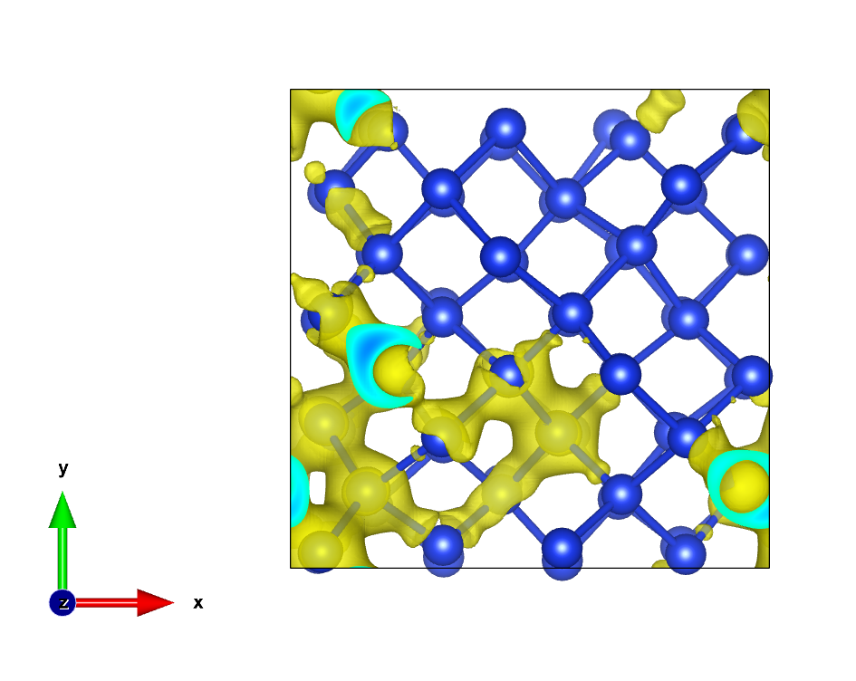
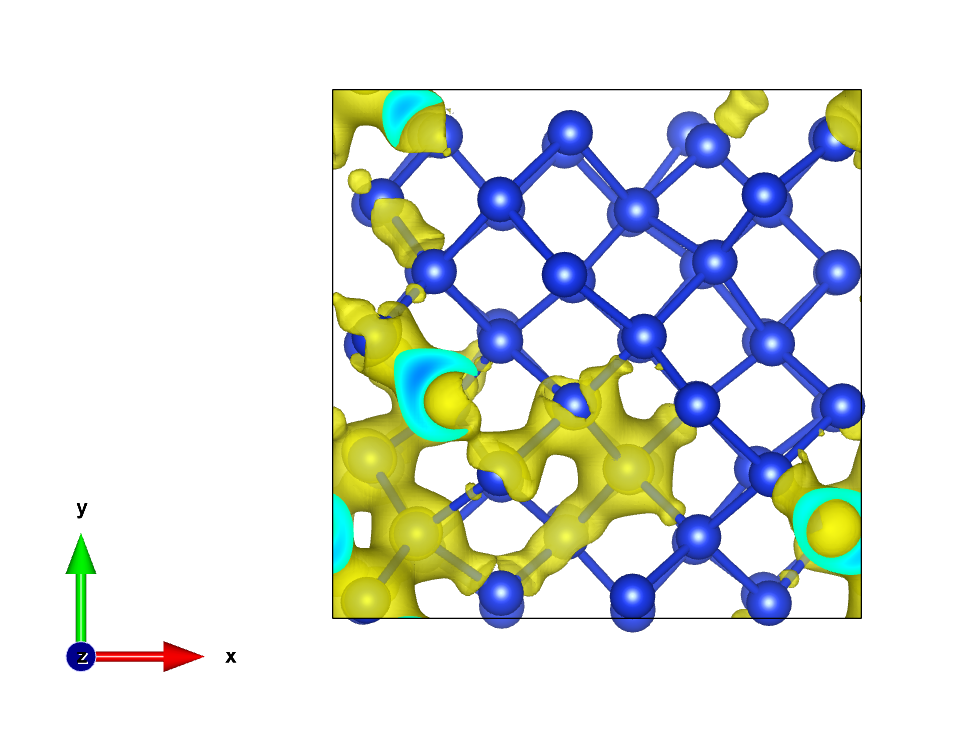

[**English**](README_EN.md) | [**中文**](README.md)

# DeepH → ABACUS WFC Converter

将 DeepH 格式 `hamiltonian.h5` 的本征向量转换为 ABACUS `WFC_NAO_K*.txt` 格式，再结合 ABACUS `get_wf` 功能获得实空间波函数 `.cube` 文件。

> 示例：64 原子 Si，DZP 基组（832 轨道），Gamma 点。

---

## Dependencies

| 工具 | 用途 |
|------|------|
| DeepH-dock | 对角化 `hamiltonian.h5`，求解本征值 / 本征矢 |
| ABACUS = 3.10-LTS | `calculation = get_wf` 读取 WFC 文件并生成 `.cube` |

---

## Data Preparation

DeepH 格式输入目录（仓库中的 `001/`）：

```
001/
├── hamiltonian.h5    # Hamiltonian 矩阵（实空间）
├── overlap.h5        # Overlap 矩阵
├── info.json         # 元数据：原子数、轨道数、基组、费米能
└── POSCAR            # 晶格 + 原子坐标
```

本仓库示例的 `info.json`：

```json
{"atoms_quantity": 64, "orbits_quantity": 832, "orthogonal_basis": false,
 "spinful": false, "fermi_energy_eV": 6.4157182229,
 "elements_orbital_map": {"Si": [0, 0, 1, 1, 2]}}
```

表示：Si 元素有 5 个 zeta 组（2s + 2p + 1d），每个 Si 原子贡献 2×1 + 2×3 + 1×5 = 13 轨道。

---

## Usage

```bash
python deeph_to_abacus_wfc.py ./001 ./WFC_NAO_K1.txt              # 只输出第 1 条能带（默认）
python deeph_to_abacus_wfc.py ./001 ./WFC_NAO_K1.txt --all-bands  # 输出全部能带
```

### 输入参数

| 参数 | 说明 |
|------|------|
| `data_dir` | DeepH 格式数据目录（含 `hamiltonian.h5` 等） |
| `output_path` | 输出的 WFC 文件路径 |
| `--all-bands` | 写出所有能带（默认只写第 1 条） |

### 输出格式

ABACUS WFC_NAO_K*.txt 纯文本，每能带一段：

```
1 (index of k points)
0 0 0
154 (number of bands)
832 (number of orbitals)
1 (band)
-4.2796723504902273171879301e-01 (Ry)
0.0000000000000000000000000e+00 (Occupations)
<real_1> <imag_1> <real_2> <imag_2> ...   # 每行 5 对，共 n_orb 对
```

轨道系数排列顺序：**逐原子**，每个原子内按 **s₁ s₂ p₁(-1,0,+1) p₂(-1,0,+1) d₁(-2,+1,+2,-1,0)**。

---

## Orbital Convention Mapping

DeepH（OpenMX 惯例）与 ABACUS WFC 的基函数排序不同，转换需要 **排列 + 符号因子**。

### 每个原子的轨道顺序对比

| l | DeepH (OpenMX) | m 顺序 | ABACUS WFC | m 顺序 |
|---|----------------|--------|------------|--------|
| 0 | `[s]` | `[0]` | `[-s]` | `[0]` |
| 1 | `[p_x, p_y, p_z]` | `[+1, -1, 0]` | `[-p_y, +p_z, +p_x]` | `[-1, 0, +1]` |
| 2 | `[d_z², d_x²-y², d_xy, d_xz, d_yz]` | `[0, +2, -2, +1, -1]` | `[-d_xy, +d_xz, +d_x²-y², -d_yz, -d_z²]` | `[-2, +1, +2, -1, 0]` |

### 映射表（per-l-shell）

DeepH → ABACUS WFC：`wfc[abacus_pos] = sign[j] × deeph[perm_inv[j]]`

| l | `perm_inv` (deeph 索引 → abacus 位置 j) | `sign` |
|---|------------------------------------------|--------|
| 0 | `[0]` | `[-1]` |
| 1 | `[1, 2, 0]` | `[-1, +1, +1]` |
| 2 | `[2, 3, 1, 4, 0]` | `[-1, +1, +1, -1, -1]` |

> 该映射在 Si 64-atom DZP 系统上通过 majority-vote 验证：**s: 64/64, p: 60+/64, d: 64/64** 原子一致。

---

## Workflow：从 DeepH 到实空间波函数


### 详细步骤

1. **生成 WFC 文件**

   ```bash
   python deeph_to_abacus_wfc.py ./001 ./WFC_NAO_K1.txt --all-bands
   ```

2. **放入 ABACUS 输出目录**

   ```bash
   cp WFC_NAO_K1.txt /path/to/abacus/OUT.{}/
   ```

3. **配置 ABACUS INPUT**

   ```
   calculation     get_wf
   out_wfc_norm    1          # 选择要输出的能带（详见 ABACUS 手册）
   ```
   >报错可以减少 mpirun -np 的参数

   `KPT` 文件只保留 Gamma 点 `0 0 0`。

4. **运行 ABACUS**

   ```bash
   mpirun -np 4 abacus
   ```

   输出 `BAND1_k_1_s_1_ENV.cube` 等 Cube 文件。

---

## Validation

> 本仓库 `001/` 中的 `hamiltonian.h5` 由 **ABACUS DFT 结果直接转换** 而来，并非 DeepH 神经网络预测结果。因此验证的是**转换代码本身的正确性**，而非 DeepH 模型的精度。

### 对比路径

| 路径 | 说明 |
|------|------|
| **A (Baseline)** | ABACUS DFT → `calculation get_wf` → `.cube` |
| **B (本工具)** | ABACUS DFT → DeepH-dock `ham.diag()` → `deeph_to_abacus_wfc.py` → ABACUS `get_wf` → `.cube` |

### 结果（等值面对比）

| ABACUS DFT 直接结果（Baseline） | 经本工具转换后 |
|:---:|:---:|
|  |  |

两张图可视化的是第 1 条能带（VBM）在 Gamma 点的实空间波函数等值面。两图一致说明轨道排列 + 符号映射正确，转换无误。

---

## Limitations

- **Gamma 点 only**：仅输出 `(0, 0, 0)` k 点
- **非自旋极化**：不支持 `nspin = 2`
- **映射已验证范围**：本映射在 Si DZP 上验证。不同元素 / 基组可能需要重新校验
  - `l = 0, 1, 2` 已覆盖，`l >= 3` 未处理
- **Occupation**：输出写为 0（占位符），未从 `info.json` 或 `wavefunction_ao.h5` 读取

---
ABACUS 获取 `WFC_NAO_K1.txt`
```
calculation     scf
out_wfc_lcao    1
```
